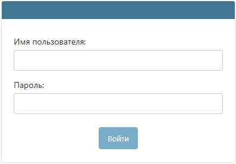
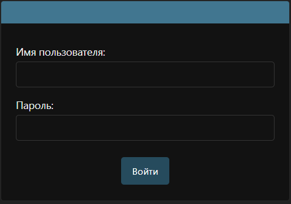

# Начинаем работу с QR-Passport
Эта инструкция – ваш помощник для начала работы. Интерфейс системы будет выглядеть по-разному в зависимости от прав доступа. Подробнее о правах доступа см. [Пользователи](company/users.md#anchor).



Все примеры в инструкции носят справочный характер. 



Для начала работы с QR-Passport войдите в систему по [ссылке](https://qrpassport.app/admin). Используйте для входа имя пользователя и пароль, которые были отправлены на вашу электронную почту.

