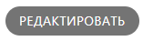
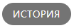

# Организация
Раздел «Организация» предназначен для настройки основной информации о компании и её структуре в системе QR-Passport. 
Он включает несколько блоков:
1. [Общая информация](#anchor)
2. [Пользователи](users.md#anchor)
3. [Департаменты](department.md#anchor)
4. [Должности](positions.md#anchor)



**Активные кнопки**

 – добавить элемент  
 – переход к блоку



|        | Активные кнопки    |
|------:|--------------------|
| | редактировать блок |
|  |  история изменений |

## Общая информация
Этот блок раздела позволяет просматривать и редактировать данные о компании. 
Основные сведения включают:
* _Основное_ – наименование компании, подключенный тариф и дату создания карточки в системе QR-Passport.

* _Реквизиты_ – ИНН, КПП, ОГРН и другие идентификационные данные.

* _Адрес и почта_ – юридический адрес, телефон и email.

* _Руководство_ – ФИО и должность руководителя компании.

* _Банковские реквизиты_ – наименование банка, БИК и другая информация о расчётном счёте.

* _Данные администратора организации_ – информация о сотруднике, который отвечает за настройку и управление системой QR-Passport.

|        | Активные кнопки    |
|:------:|--------------------|
|  | редактировать блок |
|  |  история изменений |



**Активные кнопки**

 – добавить элемент  
 – переход к блоку

