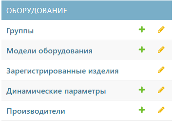

# Оборудование
Раздел «Оборудование» предназначен для создания удобной иерархии оборудования. Это поможет вам систематизировать и упорядочить список имеющегося оборудования в компании.
Он включает несколько вкладок:
1. [Группы](#anchor)
2. [Модели оборудования](models.md#anchor)
3. [Зарегистрированные изделия](registered_products.md#anchor)
4. [Динамические параметры](dynamic_parameters.md#anchor)
5. [Производители](manufacturers.md#anchor)

**Активные кнопки**
-  – добавить элемент
-  – переход к вкладке

## Группы
Для построения иерархии необходимо создать родительскую группу в QR-Passport. Эта группа станет основой для структуры оборудования.  
Для этого выполните следующие шаги:
1. Перейдите к вкладке «**Группы**» или нажмите на  для быстрого перехода к созданию группы.
2. Затем нажмите кнопку «##Добавить группу##». Откроется окно добавления группы.
3. Заполните необходимые поля.



 Поля, выделенные полужирным шрифтом, являются обязательными за заполнения. В данном случае обязательное поле – наименование (_шаг_)



4. 
5. 
6. 
7. 
8. 
9. 
10. 



Полученная структура оборудования отображается в виде иерархического списка с раскрывающимися группами. Для просмотра вложенных групп необходимо нажать на значок «**⟶**» рядом с названием группы. Свернуть группу можно, нажав на значок «**↓**», который появляется после раскрытия.


