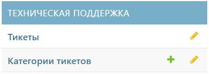

# Техническая поддержка



Этот раздел доступен только в тарифе _«Премиум»_.



Раздел «Техническая поддержка» предназначен для отслеживания статистики проблем и оперативно реагирования на инциденты.
Он включает несколько вкладок:
1. [Тикеты](#anchor)
2. [Категории тикетов](ticket_categories.md#anchor)

**Активные кнопки**
-  – добавить элемент
-  – переход к вкладке

## Тикеты
В этой вкладке раздела хранятся все запросы, поступающие от конечных пользователей.